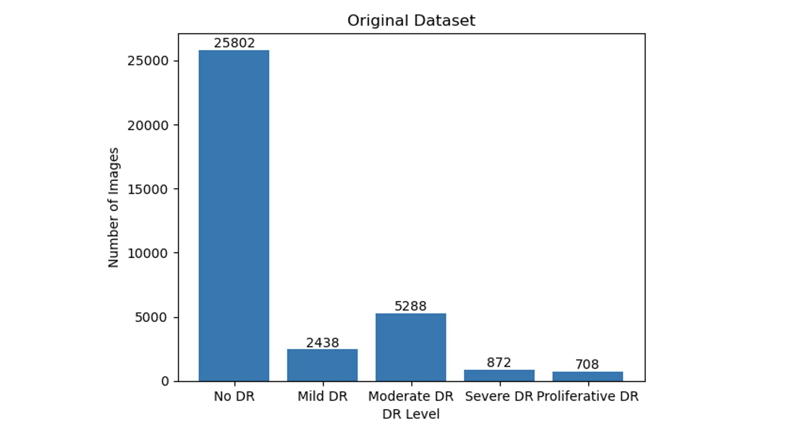
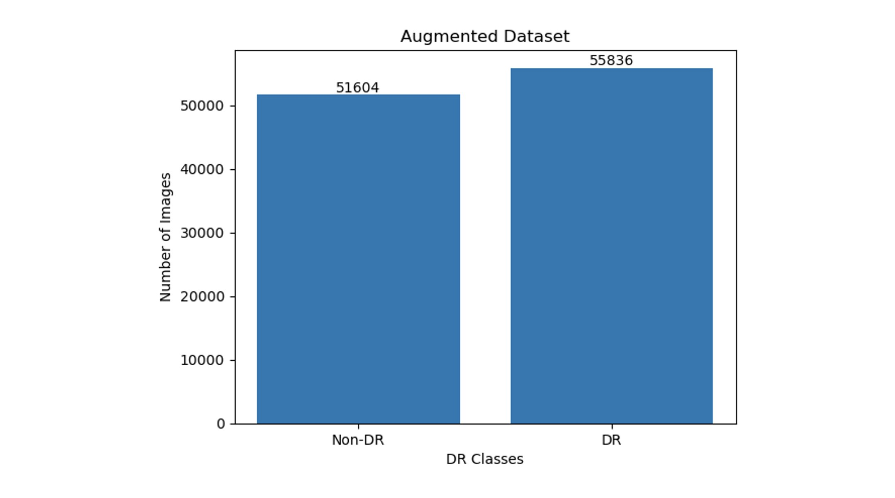
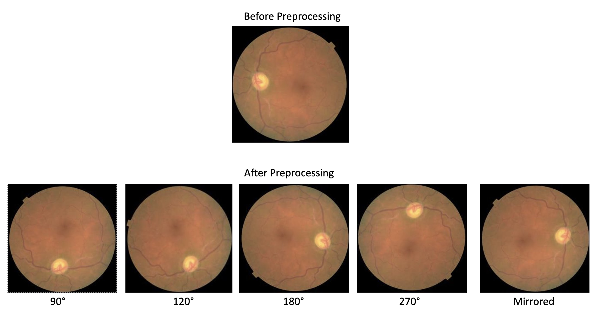
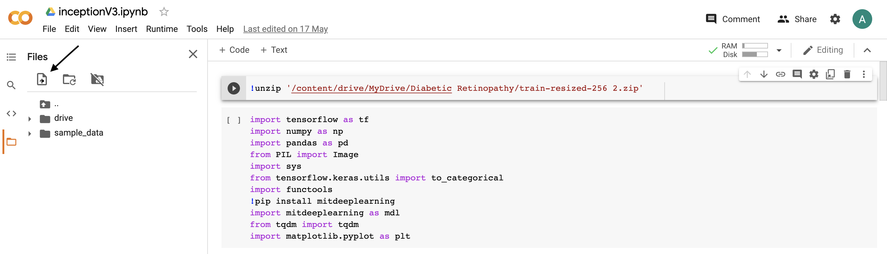

# Diabetic Retinopathy Detection

## About

Diabetic Retinopathy (DR) is a common complication of diabetes mellitus, which causes lesions on the retina that effect vision. If it is not detected early, it can lead to blindness. In this project, I use tensorflow to develop neural networks which can detect diabetic retinopathy from retinal images. 

## Data

The dataset is obtained from a [2015 Kaggle competition](https://www.kaggle.com/c/diabetic-retinopathy-detection). The original training data consists of about 35000 images taken of different people, using different cameras, and of different sizes. The dataset is heavily biased as most of the images are classified as not having DR. Pertaining to the preprocessing section, this data is also very noisy, and requires multiple preprocessing steps to get all images to a useable format for training a model.

## Preprocessing*

The preprocessing pipeline consists of the following:
1. Crop & resize all images using the resizing script.
2. Rotate & mirror all images using the rotation script.
3. Update labels for the augmented dataset.

### Crop and Resize All Images

All images were scaled down to 256 by 256. Additionally, some images were dropped from the training set. Scikit-Image raised multiple warnings during resizing, due to these images having no color space. Because of this, any images that were completely black were removed from the training data.

### Rotate and Mirror All Images

All images were rotated and mirrored.Images without retinopathy were mirrored; images that had retinopathy were mirrored, and rotated 90, 120, 180, and 270 degrees.

After rotations and mirroring, the class imbalance is rectified, with a few thousand more images having retinopathy.

### Update Labels

A new csv file is created for the augmented dataset which maps each image to a DR level. 

****pre-processing code taken from Grew Chase's [EyeNet](https://github.com/gregwchase/eyenet).***

## Neural Network Architecture

I train two kinds of neural networks in this project. The first is a standard Convolution Neural Network (CNN) consisting of basic convolution and pooling layers. The second is the InceptionV3 model developed by Google. The architectures for both the models are included in the [neural_nets](https://github.com/ramanakshay/Diabetic-Retinopathy-Detection/tree/main/neural_nets) folder.

## Training

The data is split into two parts. 80% of the data is used for training and the remaining 20% is used for validation. The training data is the data used to train the model and the validation data is used to tune the model’s hyper parameters (optimizer, learning rate, batch size, epoch size...). We perform transfer learning on the InceptionV3 model by using a pre-trained network trained on the ImageNet dataset. 

## Using Google Colab

To train the model using Google Colab, first import the neural network architecture (.pynb file) from the neural_nets folder. Then, import the .csv file containing the labels for the augmented dataset. Import the dataset by unzipping the image folder from Google Drive using the following command - 

`!unzip '/content/drive/MyDrive/filepath/filename.zip'`

The program directly accesses images from the directory to train the model without converting the entire dataset to numpy format (which consumes a lot of space ~20GB).

## Results

The current models return the following scores for binary classification (DR vs No DR) on the dataset.
| Model | Accuracy |
| :-----: | :-----: |
| Standard CNN (Training) | 82.2% |
| Standard CNN (Validation) | 82.2% |
| InceptionV3 (Training) | 86.0% |
| InceptionV3 (Validation) | 85.8% |

